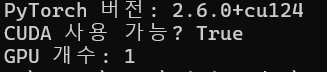
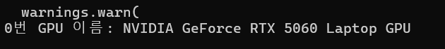

# Windows GPU 딥러닝 환경 구축 (PyTorch + Keras)

Windows 노트북(예: RTX 5060 Laptop GPU)에서 VS Code와 Jupyter Notebook을 사용해  
PyTorch 및 TensorFlow/Keras 기반 딥러닝 실습을 진행하기 위한 GPU 환경 설정 방법을 정리합니다.


## 1. 사전 요구 사항

- OS: Windows 10 / 11 (64-bit)
- GPU: NVIDIA GeForce 계열 (예: RTX 5060 Laptop GPU, 8GB VRAM)
- 드라이버: 최신 NVIDIA 그래픽 드라이버
- 필수 소프트웨어
  - [Anaconda](https://www.anaconda.com/) 또는 [Miniconda](https://docs.conda.io/en/latest/miniconda.html)
  - [Visual Studio Code](https://code.visualstudio.com/)

- gpu 설정
  ```
  nvidia-smi
  ```


## 2. git 레포짓 다운로드하기
```
git clone https://github.com/sano820/windows-gpu.git
# 또는 zip파일로 다운로드하기
```
그 후 터미널을 해당 폴더까지 이동 시키기  
```
# 현재 폴더 위치 확인
pwd   # PowerShell
# 또는
ls   # cmd, git bash 환경

# windows-gpu 폴더 위치까지 이동 시키기
cd 새싹/windows-gpu
```

## 3. 가상환경 생성
anaconda prompt에서 실행

```
conda create -n gpu_env python=3.10 -y
conda activate gpu_env
```

## 4. 실습을 위한 주피터 노트북 커널
```
# (gpu_env 활성화 상태)
pip install jupyter ipykernel

python -m ipykernel install --user --name gpu_env --display-name "gpu_env test"
```

## 5. tensorflow + CUDA 11.2 + cuDNN 8.1 설치 (conda)
```
conda install -c conda-forge cudatoolkit=11.2 cudnn=8.1.0 -y

python -m pip install "tensorflow<2.11"
```

## 6. GPU 사용 가능한지 확인
아래 이미지들 처럼 결과가 나오면 성공!  
```
python check_gpu.py
```
  
  

## 7. 실습을 위한 라이브러리 설치
```
pip install -r requirements.txt
```

## 8. ipynb 실습 파일 실행
gpu_env test 이름으로 되어있는 커널 선택!  
그러면 gpu를 사용한 cnn 모델 학습 끝!  


## 추후 내용 PyTorch + CUDA 설치
가상환경 내 설치
```
pip install torch torchvision torchaudio --index-url https://download.pytorch.org/whl/cu124
```
